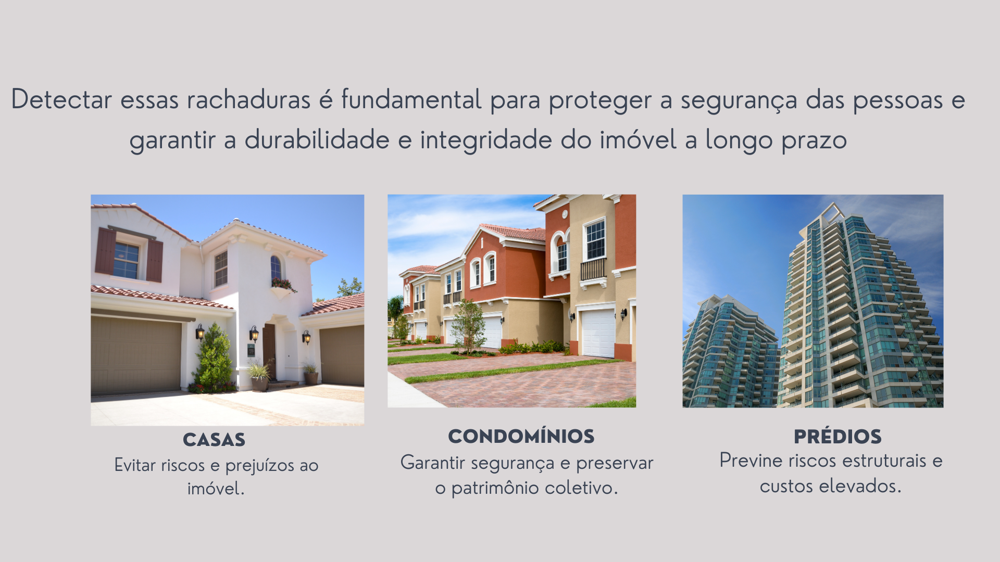

# Sistema de Detecção de Rachaduras em Prédios
##  Descrição Geral do Sistema

Este sistema utiliza visão computacional para detectar e monitorar rachaduras em prédios. Ele é
baseado em tecnologias modernas, como redes neurais convolucionais (CNNs), e oferece uma
solução automatizada para manutenção preventiva e corretiva. O sistema é composto por várias
etapas, desde a captura de imagens até a análise e emissão de alertas.

## Objetivo
Mostrar como criamos um sistema que usa visão computacional para encontrar e monitorar rachaduras em prédios, ajudando na manutenção preventiva e corretiva.

## Motivação
Garantir a segurança das estruturas e evitar gastos desnecessários com reparos tardios.

## Visão geral do Sistema

* É um programa que usa inteligência artificial, com foco em redes neurais convolucionais (CNNs).
* Ele analisa imagens capturadas, identifica rachaduras e emite relatórios detalhados. (posteriormente)
* Permite encontrar problemas cedo, antes que causem danos maiores.
* Facilita o acompanhamento contínuo de prédios.

## Especificações Técnicas

- Linguagem: Python
- Biblioteca: OpenCV
- Hardware: Câmeras de alta resolução, drones
- Banco de Dados: MySQL, PostgreSQL, AWS S3
- Interface: Aplicativos web e móveis para monitoramento

## Arquitetura do Sistema

### O sistema segue uma arquitetura modular com as seguintes etapas principais:

- Captura de Imagens: Uso de câmeras ou drones para obter imagens do prédio.
- Pré-processamento: Melhoria da qualidade das imagens usando filtros.
- Detecção de Rachaduras: Redes neurais para identificar rachaduras.
- Classificação: Avaliação da gravidade com base em padrões definidos.
- Análise e Relatórios: Geração de relatórios e alertas automáticos.

## Público-alvo

## Front-end

## Importância do Projeto
#### Aumenta a segurança;   Economiza recursos;   Preserva prédios;

#### PRINCIPAIS VANTAGENS:
Detecta problemas com rapidez e precisão.
Pode ser usado em prédios de diferentes tipos e tamanhos.
Aumenta a segurança, prevenindo acidentes causados por falhas estruturais.
Economiza dinheiro, evitando reparos emergenciais.

#### BENEFÍCIOS PARA A COMUNIDADE:
Torna os prédios mais seguros para quem vive ou trabalha neles.
Ajuda a preservar prédios históricos e culturais.
Reduz o impacto ambiental ao evitar grandes reformas de última hora.

___________________________________________________________________________

Você pode encontar o algoritmo do projeto [clicando aqui!😁]()

